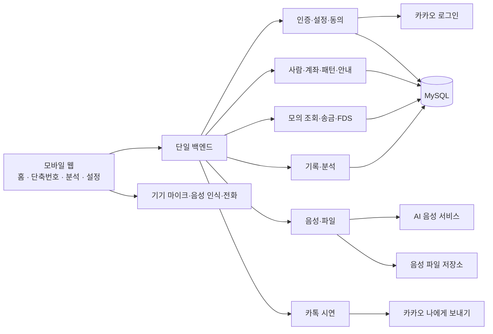

# 아키텍처

[목차](../requirements.md)

## 구성

| 영역 | 책임 |
| --- | --- |
| 화면·이동 | 단계·입력·확인·접근성·쉬운 상태 안내 |
| 임시 상태 | 현재 송금·편집/녹음 초안·재생 |
| 인증·설정 | 카카오 사용자 연결·세션·동의·기본 설정 |
| 사람·계좌 | 사람별 복수 계좌·내 계좌·보호자 전화 |
| 패턴·안내 | 번호·템플릿·연결 계좌·순서·문구·대상별 음성 |
| 모의 금융 | 조회·PIN/잔액 확인·송금/거래 일관성 |
| FDS | 고액·반복·재확인·최종 결정 |
| 음성 | 합성·가족 파일 저장/교체·재생 참조 |
| 기록·분석 | 동의·방문/행동 합계·기간 집계·문구 제안 |
| 카톡 | 조건·동의 확인, 본인 전송, 실제/모의 결과 |

## 데이터 관계

| 관계 | 수·조건 |
| --- | --- |
| 사용자 → 내 계좌·등록 사람·패턴·판정 | 각각 여러 개 |
| 사람 → 받는 계좌 | 한 개 이상 |
| 템플릿 → 패턴 | 여러 개 |
| 송금 패턴 → 받는 계좌 | 특정 계좌 하나 |
| 패턴 → 단계 | 순서 있는 한 개 이상 |
| 패턴 → 안내 대상 | 시작 안내 하나 + 단계별 안내 |
| 안내 대상 → 가족 파일 | 현재 녹음 0–1개 |
| 패턴 → 실행 → 단계 방문 | 각각 여러 개, 동의 시 기록 |
| 내 계좌 → 거래 | 여러 개 |
| 패턴 송금 실행 → 새 거래 | 0–1개, 완료 시 연결 |
| 이상거래 → 새 거래 | 0–1개, 계속 완료 시 연결 |

## 데이터 항목

| 대상 | 필요한 정보 |
| --- | --- |
| 사용자·세션 | 로그인 식별·이름·세션 상태 |
| 설정·동의 | 글씨·속도·기본 음성·선택 완료·두 선택값 |
| 내 계좌 | 은행·계좌 식별·잔액·모의 PIN 비교 자료·기본 계좌 |
| 사람·받는 계좌 | 이름·관계 / 은행·번호·별칭·사람 연결 |
| 보호자 | 사용자별 전화번호 하나 |
| 템플릿 | 7종 업무·기본 설명·단계·기본 문구 |
| 패턴 | 이름·활성·번호·템플릿·특정 받는 계좌 |
| 단계 | 고유 식별·순서·화면 역할·현재 문구 |
| 안내 대상 | 시작/단계 구분·문구·방식 |
| 가족 파일 | 참조·형식·문구 불일치 |
| AI 파일: 선택 | 문구/방식/속도/설정 일치 기준·준비 상태·참조 |
| 실행 | 패턴·실제 내 계좌·시작/종료·결과 |
| 방문 | 실행·단계·방문 순번·시각·행동 합계 |
| 거래 | 내 계좌·분류·금액·시각·받는 정보 |
| 판정 | 사용자·송금 정보·사유/단계·재확인·결정·실제 알림 시각 |

## 기능 입출력

| 작업 | 입력 | 결과 |
| --- | --- | --- |
| 로그인·내 정보 | 인증 결과 또는 세션 | 사용자·설정·동의·계좌 준비 |
| 설정·동의 | 변경값·선택 | 저장값·완료 여부 |
| 계좌 불러오기 | 모의 후보 선택 | 추가 계좌·기본 상태 |
| 사람·계좌 관리 | 사람 또는 계좌 정보 | 사람·복수 계좌 |
| 패턴 저장 | 템플릿·번호·업무·계좌·안내 | 저장 패턴·단계 |
| 번호 변경 | 확인된 전체 순서 | 저장 순서 |
| 안내 저장 | 대상·문구·방식·녹음 변경 | 저장값·기본 문구·녹음 상태 |
| 음성 | 문구·속도 또는 실제 파일·대상 | 재생 참조 또는 실패 |
| 패턴 시작 | 확인한 패턴 | 최신 단계·기록 가능 여부·실행 |
| 조회·전화 | 업무·내 계좌 또는 연락처 대상 | 모의 조회 결과·전화번호 |
| 송금 | 내/받는 계좌·금액·일회 PIN·해당 실행/마지막 행동 | 거래·잔액 또는 재확인 |
| 판정 결정 | 대상·재확인 여부·계속/취소 | 결정·해당 거래 |
| 카톡 | 미결정 높은 주의·명시적 선택 | 실제/모의 전송 결과 |
| 방문 기록 | 실행·단계·방문·합계·이동 | 기록 상태 |
| 분석 | 사용자·기간 | 횟수·정렬·후보·근거 |
| 문구 적용 | 단계·기간·비교한 문구·선택 | 비교 또는 저장 문구 |

## 핵심 흐름

| 흐름 | 순서 |
| --- | --- |
| 첫 이용 | 소개 → 로그인 → 동의 → 모의 계좌 → 홈 |
| 번호 송금 | 말하기 → 매칭 → 확인창 → 시작 → 송금 단계 → 서버 판정 → 결과 |
| 기록 종료 | 마지막 행동 전달 → 금융 결과·방문·실행 종료 |
| 안내 개선 | 기간 집계 → 후보 → 비교 → 명시적 적용 → 같은 단계 반영·재녹음 |

## Agent Notes

- Reuse the current BE package/layer organization. These boxes are responsibilities inside one backend, not new services or a replacement package layout.
- This is conceptual design, not Java implementation, HTTP field names, or physical SQL schema. See [delivery scope](delivery-constraints.md).
- Distinguish person/account identity and step identity/order. Runtime source selection must match execution and transaction.
- A pre-start target has no step; each step target identifies exactly one step. Inquiries create no new transfer; direct transfers have no pattern execution.
- Store audio in a file store, references/metadata in DB. Isolate credentials from business records and analytics.
- Specify partial-save retry identity and transfer/last-visit finalization ownership in the event-day contract.
- Preserve explicit target modes, recordings, history, and prior data on unrelated changes.
- Frontend renders verified results; it does not decide risk or invent bank, transfer, or delivery success.
- No real banking, MyData, remote guardian account, voice authentication, or health diagnosis.
- Acceptance: [SC-011, 015–017](validation-scenarios.md).
